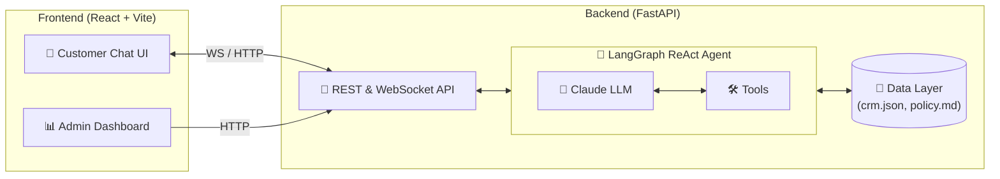

<div align="center">
  

  <h1>🛒 ShopEasy AI Refund Agent</h1>
  
  <p>
    <strong>An autonomous, policy-driven customer support agent for instant e-commerce refund processing.</strong>
  </p>

  <p>
    <a href="#features"></a>
    <a href="#tech-stack"></a>
    <a href="#tech-stack"></a>
    <a href="#tech-stack"></a>
    <a href="#license"></a>
  </p>
</div>

---

## 📖 Project Overview

Customer support teams are often overwhelmed with routine refund requests, leading to increased resolution times and degraded customer experience. The **ShopEasy AI Refund Agent** solves this by introducing a fully autonomous, AI-powered system that handles customer refund claims end-to-end.

Powered by a **LangGraph ReAct loop** and **Claude (Anthropic)**, the agent intelligently parses customer issues, performs CRM lookups, validates complex business rules, and executes or denies refunds in real-time. It ensures strict adherence to company policy while providing a seamless, conversational experience for the user.

---

## ✨ Key Features

- **🧠 Autonomous Reasoning**: Employs a robust LangGraph ReAct (Reason + Act) state machine to make dynamic tool-calling decisions.
- **🛡️ Strict Policy Enforcement**: Hard-coded and prompt-embedded evaluation of 7 key business rules (e.g., denying digital goods, clearance items, or out-of-window requests).
- **🔌 CRM Integration**: Tools to dynamically search mock customer profiles (15 pre-configured edge cases) by ID, email, or order number.
- **⚡ Real-Time Streaming**: Features a WebSocket connection to stream the agent's thought process and reasoning logs directly to the administrative dashboard.
- **📱 Responsive UI**: A split-pane React frontend featuring a conversational customer window and an admin reasoning inspector.

---

## 🛠️ Tech Stack

### Backend
- **Framework**: [FastAPI](https://fastapi.tiangolo.com/) for high-performance REST and WebSocket APIs.
- **AI Agent**: [LangGraph](https://langchain-ai.github.io/langgraph/) & [LangChain](https://www.langchain.com/) for stateful, multi-actor LLM orchestration.
- **LLM**: [Anthropic Claude](https://www.anthropic.com/claude) via `langchain-anthropic`.
- **Package Manager**: [uv](https://github.com/astral-sh/uv) for lightning-fast Python dependency management.

### Frontend
- **Framework**: [React 19](https://react.dev/) + [Vite](https://vitejs.dev/).
- **Icons & Styling**: [Lucide React](https://lucide.dev/).

---

## 📐 Architecture



---

## 📁 Project Structure

```text
Refund-agent/
├── backend/
│   ├── agent/                 # LangGraph state machine, tools, and prompts
│   ├── data/                  # Mock CRM database (15 profiles) & refund policy
│   ├── routers/               # FastAPI endpoints (chat, admin, websocket)
│   ├── database.py            # In-memory CRM loader
│   ├── main.py                # FastAPI application entry point
│   └── pyproject.toml         # Backend dependencies & metadata
└── frontend/
    ├── src/
    │   ├── components/        # React components (ChatWindow, AdminPanel, etc.)
    │   ├── hooks/             # Custom hooks (e.g., useWebSocket)
    │   └── App.jsx            # Application layout
    ├── package.json           # Frontend dependencies
    └── vite.config.js         # Vite configuration and API proxy
```

---

## 🚀 Installation and Setup

### Prerequisites
- Python 3.12+ (with `uv` installed)
- Node.js 18+
- Anthropic API Key

### 1. Clone the Repository
```bash
git clone https://github.com/vijaygaddi89-rgb/Refund-agent.git
cd Refund-agent
```

### 2. Environment Variables
Copy the example environment file and add your credentials:

```bash
cp .env.example .env
```

| Variable | Description | Required |
|----------|-------------|----------|
| `ANTHROPIC_API_KEY` | Your Anthropic Claude API Key | **Yes** |

### 3. Backend Setup
Navigate to the root or backend directory and start the FastAPI server using `uv`:

```bash
# Navigate to backend (if required)
# cd backend 

# Install dependencies and start the server
uv run uvicorn main:app --reload --port 8000
```
*The backend will be available at `http://localhost:8000`.*

### 4. Frontend Setup
In a new terminal, navigate to the frontend directory:

```bash
cd frontend
npm install
npm run dev
```
*The frontend will be available at `http://localhost:5173`.*

---

## 💡 Usage Examples

The agent is pre-configured to handle various edge cases based on the mock data. Try the following scenarios in the chat UI:

1. **✅ Standard Approval**
   > *"My order ORD-2026-001 arrived with broken headphones. I'd like a refund."*
   > **Result:** Agent validates standard policy, checks return window, and approves a $129.99 refund.

2. **❌ Digital Product Denial**
   > *"I want a refund for my Adobe Creative Suite license, order ORD-2026-007."*
   > **Result:** Agent identifies the item as a digital product and denies the refund per Section 2 of the policy.

3. **⏰ Outside Return Window**
   > *"My yoga mat from order ORD-2026-002 is terrible quality."*
   > **Result:** Agent calculates the days elapsed based on customer tier and denies the refund as it is outside the allowed window.

---

## 🔌 API Documentation

| Method | Endpoint | Description |
|--------|----------|-------------|
| `POST` | `/api/chat` | Process a single-turn chat message. Body: `{message, history}`. |
| `WS`   | `/api/ws/{session_id}` | WebSocket for real-time streaming of agent reasoning logs. |
| `GET`  | `/api/admin/customers` | Fetch all mock CRM customer profiles. |
| `GET`  | `/api/admin/stats` | Fetch aggregate agent performance statistics. |
| `GET`  | `/health` | Health check endpoint. |

---

## 📸 Screenshots

> **TODO:** Add screenshots or a GIF demonstrating the chat UI, the admin reasoning dashboard, and a successful refund flow.
> 
> *Example:*
> ``

---

## 🐳 Docker Deployment

> **TODO:** Add Dockerfile and `docker-compose.yml` for containerized deployment.
> 
> *Planned implementation will include multi-stage builds for the Vite frontend and the FastAPI backend.*

---

## 🧪 Testing

> **TODO:** Add comprehensive test suite using `pytest` for the backend agent logic and `Vitest` for frontend components.
> 
> *Run tests using:* `uv run pytest` (Coming Soon)

---

## 🗺️ Roadmap

- [x] Integrate LangGraph ReAct agent architecture.
- [x] Implement WebSocket streaming for reasoning logs.
- [x] Build React + Vite split-pane interface.
- [ ] **Phase 2:** Connect to a real database (PostgreSQL/SQLAlchemy).
- [ ] **Phase 3:** Dockerize the application for simple 1-click deployments.
- [ ] **Phase 4:** Add human-in-the-loop escalation UI for ambiguous edge cases.

---

## 🤝 Contributing

Contributions are welcome! Please follow these steps:

1. Fork the project.
2. Create your feature branch (`git checkout -b feature/AmazingFeature`).
3. Commit your changes (`git commit -m 'Add some AmazingFeature'`).
4. Push to the branch (`git push origin feature/AmazingFeature`).
5. Open a Pull Request.

---

## 📄 License

> **TODO:** Add `LICENSE` file to the repository.
> 
> This project is currently unlicensed. Please add an appropriate open-source license (e.g., MIT, Apache 2.0).

---

## 👨‍💻 Author

**Vijay Gaddi**  
GitHub: [@vijaygaddi89-rgb](https://github.com/vijaygaddi89-rgb)

---
<div align="center">
  <i>Built for the AI Customer Support Agent Challenge.</i>
</div>
